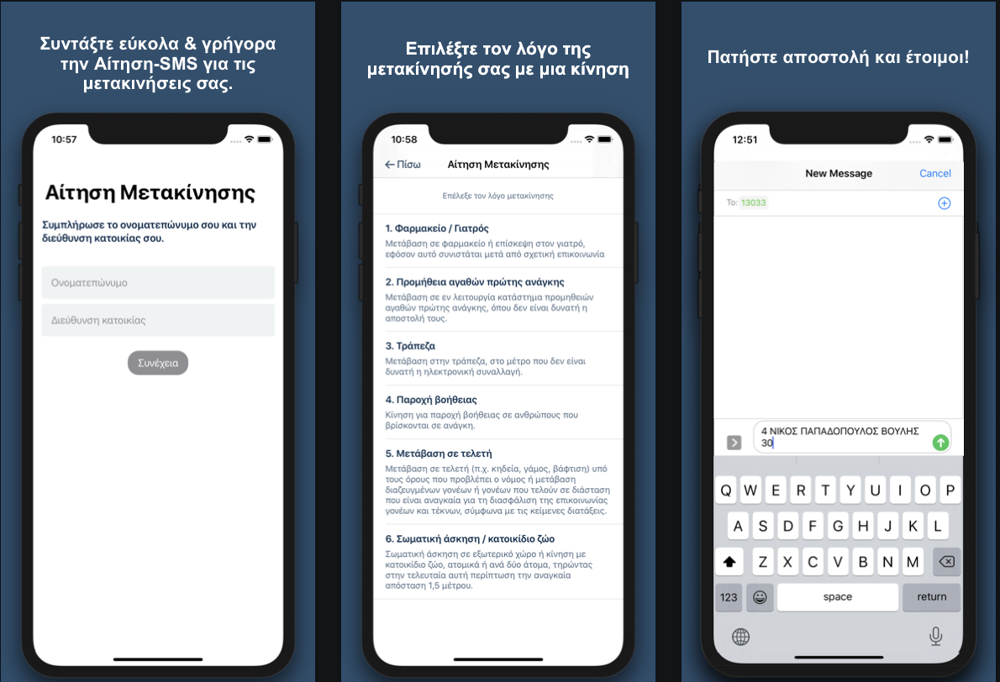

# #MenoumeSpiti-MovementSMS
An easier way to send the Greek Movement Authorisation SMS that was (still is at the time of writing this, but I'm trying to be optimistic here) required during the COVID-19 lockdown described in https://forma.gov.gr/en/ 

Inspired by [@ptsiogas](https://github.com/ptsiogas)

Made with SwiftUI, never approved by the AppStore



Future humans feel free to use this in the next quarantine. Current humans I prohibit you from using this... I'm kidding, do whatever.

## Build Instructions

Open terminal and cd to the root folder of the repo

```bash
$: pod install
```

After the installation is complete open MenoumeSpiti-MovementSMS.xcworkspace in XCode, press build and it should run.